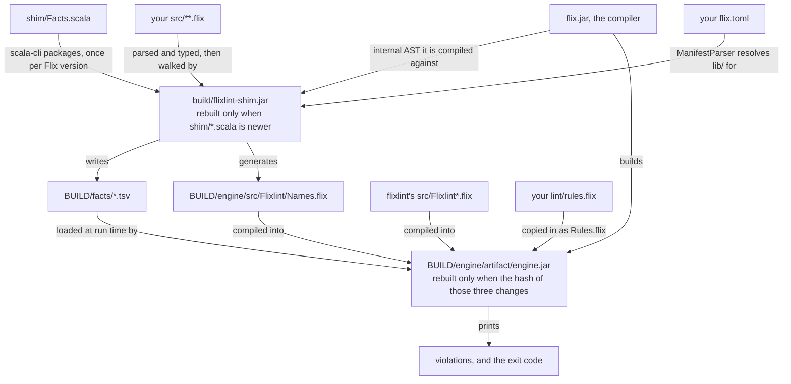
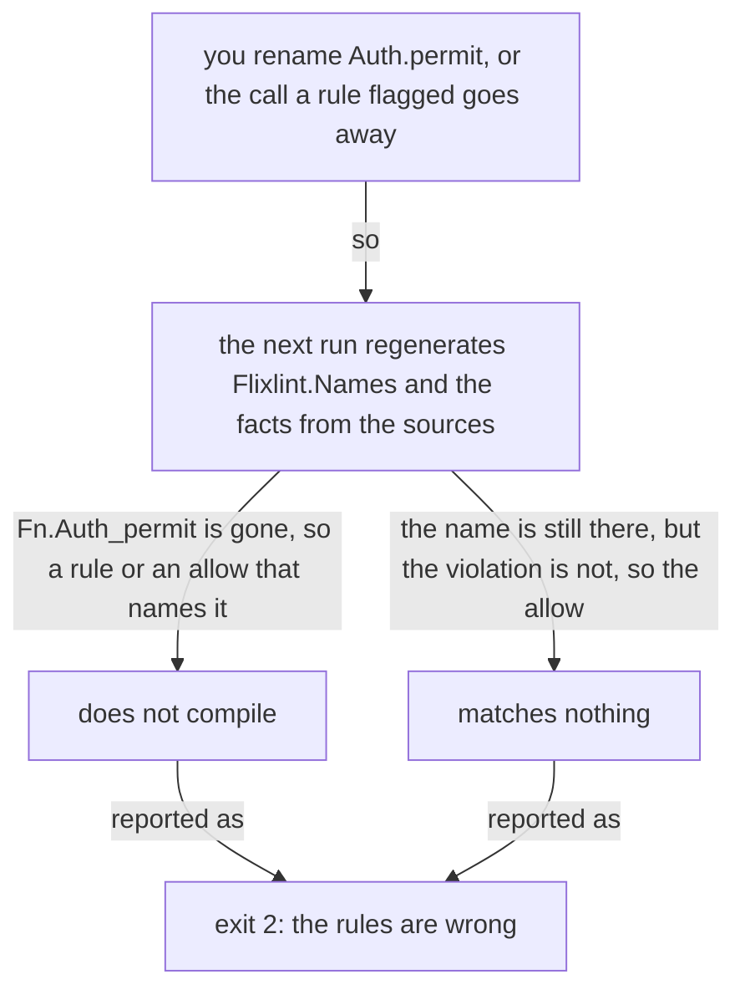
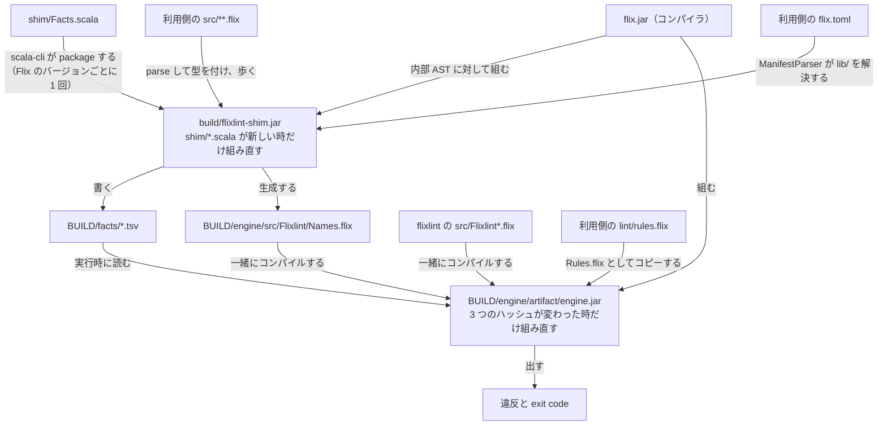
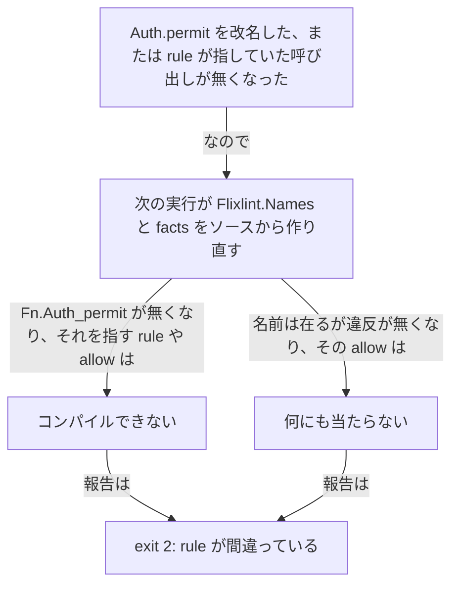

# flixlint

*日本語版はこのページの[下半分](#flixlint日本語)にあります。英語版が正。*

Architecture rules for [Flix](https://flix.dev) projects, checked on the compiler's AST instead of with `grep`.

The compiler already builds a typed AST of the whole project; flixlint asks it for a handful of language-level
**facts** (which function is defined where, who calls whom, which effects a signature has, where a handler is
installed, which enum case is built where, what the types of a signature are made of, which lambda a call sits in, which
literal or call is an argument, what a `|>` chain passes along) and writes them as TSV. Rules are written in
Flix, as records in the style of Clippy's `clippy.toml`: one entry says what is disallowed, why, and which functions
are allowed anyway. The names of functions, effects, modules, cases, enums and types are enums generated from the
facts, so a rule that names something the sources no longer have does not compile, and an allow that no longer covers
anything is an error.

flixlint knows nothing about any particular project: the names of effects, modules, files and enum cases are the
rules' business, not the linter's.



`bin/flixlint` drives all of this: the shim walk runs on every lint, the two jars are rebuilt only when what they are
keyed on changed, and `BUILD` is `--build-dir` (default `build/flixlint`).

## Installing

flixlint is a **tool**, not a Flix library: it is delivered as this repository, and a project that wants to be linted
calls `bin/flixlint`. It is deliberately not something you put in your `flix.toml` `[dependencies]` — see
[Why it is not an fpkg](#why-it-is-not-an-fpkg).

```bash
# next to the project that will be linted, or anywhere else
git clone https://github.com/ababup1192/flixlint.git
# or, inside the project:
git submodule add https://github.com/ababup1192/flixlint.git flixlint
```

The project to lint is an ordinary Flix project; an empty one is `java -jar flix.jar init` in an empty directory.

You need a JDK and the Flix compiler jar of the version in `flix.toml` (`flix = "0.76.0"`). Download `flix.jar`
from [Flix's GitHub releases](https://github.com/flix/flix/releases) and pass it with `--flix-jar` or `FLIX_JAR`;
with neither, `bin/flix-jar` takes the `share/java/flix/flix.jar` next to the `flix` on `PATH`.

The Scala shim is built once, on first use and whenever `shim/*.scala` changes, into `build/flixlint-shim.jar`.
That needs `scala-cli`: `devbox.json` has it, and a `scala-cli` on `PATH` is used when there is no devbox. If you
have neither, take `flixlint-shim-<flix version>.jar` from the release and pass it with `--shim` or `FLIXLINT_SHIM`
(`make release` is what attaches it). The jar holds only flixlint's own classes, compiled against the compiler's
internal AST, so one jar per Flix version serves every machine and every project.

```bash
make test            # lint test/fixture and examples/, diff the reports against test/expected*.txt
make test-resolved   # the same at the resolved stage
make shim            # rebuild build/flixlint-shim.jar
```

`make test` is also the type check of the rule engine: `src/Flixlint*.flix` only compiles together with a generated
`Names.flix`, so running a project through is the only way to compile it. This repository therefore has no
`flix check` of its own — `test/` holds a fixture that must not compile (`rules/broken.flix` names a function the
sources do not have), which is exactly what the test asserts.

## Using it from your project

Keep one file in your project — the rules — and call flixlint with the compiler jar:

```make
lint:
	../flixlint/bin/flixlint --flix-jar /path/to/flix.jar --rules lint/rules.flix --stage resolved src
```

| What | Where | Committed |
|---|---|---|
| the rule file | anywhere; `--rules` names it (`lint/rules.flix` here) | yes, it is your architecture |
| the call | a `lint` target, and the same line in CI | yes |
| flixlint itself | a clone anywhere, or a submodule in the project | the submodule, if you take one |
| the facts, the generated `Names.flix`, the rule engine and its jar | `--build-dir` (default `build/flixlint`) | no, `.gitignore` it |
| the shim jar | flixlint's own `build/`, or wherever `--shim` points | no |

When neither `--pkg` nor `--jar` is given, the shim reads your `flix.toml` with
the compiler's own `ManifestParser` and passes the versions it names out of `lib/`, where the compiler has unpacked
them: `lib/github/<owner>/<name>/<version>/` for a Flix package (its own manifest is read there too, so a package's
own dependencies come along), `lib/external/` for a `[jar-dependencies]` jar, and every jar under `lib/cache/` for
`[mvn-dependencies]`. Nothing is downloaded. The project is the nearest directory with a `flix.toml` at or above the
sources, never above the current directory; `--project-root DIR` names it when that is not where it is. A project
with no dependencies gets nothing, and `--pkg` / `--jar` override the whole thing. The packages do
have to be unpacked: one that `flix.toml` names and `lib/` does not have is exit 4, with the message to run
`flix check` once; if you pass `--pkg` / `--jar` yourself and miss one, the sources do not compile and it is exit 3.

Your rule file names things through the generated module, so it starts with
`use Flixlint.Names.{Fn, Eff, Mod, Case, Enum, Type}`.

### Why it is not an fpkg

`flix build-pkg` puts `flix.toml`, `README.md`, `LICENSE.md` and `src/**/*.flix` into the package and nothing else —
a jar or a resource file under `src/` is dropped, and so is everything outside `src/`. So neither `bin/flixlint` nor
the shim jar can travel in an fpkg. On top of that, `src/Flixlint*.flix` refers to the generated `Flixlint.Names`
module, so
as a package it would not compile in the consumer's project at all — and it has no business being compiled into the
consumer's program, since only the throwaway rule-engine project that `bin/flixlint` generates ever uses it.

Flix does have `[jar-dependencies]` (`"name.jar" = "url:https://..."`, downloaded into `lib/external/`), and it is
applied to transitive manifests too, but it delivers a jar to the consumer's *compile* classpath, which is not where
the shim runs: the shim runs on the compiler jar's classpath inside `bin/flixlint`. Hence the release asset.

## Usage

```
bin/flixlint [--flix-jar JAR] --rules PATH/rules.flix [--pkg FPKG]... [--jar JAR]... [--stage typed|resolved]
             [--today YYYY-MM-DD] [--facts-out DIR] [--build-dir DIR] [--project-root DIR] [--shim JAR]
             [--java-opts "..."] SRC...
bin/flixlint --version
```

| Option | Meaning |
|---|---|
| `--flix-jar JAR` | The Flix compiler (`flix.jar`, 0.76.0). `FLIX_JAR` in the environment works too; with neither, `bin/flix-jar` resolves it. |
| `--rules PATH/rules.flix` | The rule file: a Flix module with `pub def rules(): Flixlint.RuleSet` (see below). |
| `--pkg FPKG` / `--jar JAR` | Dependencies the sources need (`lib/**/*.fpkg`, `lib/cache/**/*.jar`). Repeatable. With neither, they are read from the project's `flix.toml`. |
| `--project-root DIR` | The directory whose `flix.toml` names the dependencies (default: the nearest one at or above the sources, within the current directory). |
| `--stage typed` (default) | Facts from the typed AST (`Flix.check()`): everything below, including compile errors. |
| `--stage resolved` | Facts from the AST right after name resolution, before kinding and typing. Several times faster; the same facts except Java instance-method calls (the receiver's class is not known yet). |
| `--today YYYY-MM-DD` | The date `allowUntil` is compared with (default: the real date). Tests fix it. |
| `--facts-out DIR` | Where the TSV facts go (default `BUILD/facts`). Keep them: they are the easiest way to look up a qualified name. |
| `--build-dir DIR` | Working directory for the facts and the rule engine (default `build/flixlint`), relative to the current directory. |
| `--shim JAR` | A prebuilt shim jar, instead of building one with `scala-cli`. `FLIXLINT_SHIM` works too. |
| `--java-opts "..."` | The JVM options both java steps get (default `-Xss32m -XX:MaxRAMPercentage=35`). `FLIXLINT_JAVA_OPTS` works too. |
| `--version` | The version in `flix.toml`. |
| `SRC...` | Source directories or files, relative to the current directory. File paths in violations and in `allowInFile` are relative to that directory too. |

| Environment | Meaning |
|---|---|
| `FLIX_JAR` | The compiler jar, when `--flix-jar` does not say. |
| `FLIXLINT_SHIM` | A prebuilt shim jar, when `--shim` does not say. |
| `FLIXLINT_JAVA_OPTS` | The default for `--java-opts`. |
| `FLIXLINT_ENGINE_ROOT` | The last place `bin/flix-jar` looks for a compiler jar (default `~/Desktop/flix_game_engine`, the author's devbox). |

Exit codes: `0` no violation, `1` violations, `2` the rules are wrong (the rule file does not compile, an allow that
covers nothing, an `allowInFile` of a file that is not among the sources), `3` the sources do not compile, `4` the
call or the environment is wrong (an option flixlint does not know, no `flix.jar`, no `scala-cli` and no `--shim`, a
dependency that is not unpacked, a crash in the fact walker). `2` and `3` are what your sources and rules say; `4`
never is, so a `4` in CI is a broken setup rather than a lint finding.

A violation is a `file:line:` header editors pick up, then the rule's reason, the path through the wrappers when
`transitivelyIn` found it, and how to get rid of it:

```
src/Report.flix:14: clock: Report.title: calls Wall.today
    the real clock is read where Main builds the clock; everything else takes the time as an argument
    Wall.today -> Wall.nowMillis -> java.lang.System.currentTimeMillis
    fix it, or add |> allowIn(Fn.Report_title, "reason") to rule clock
```

Violations are sorted by file, line and rule id, so the report is the same on every run.

The rule engine is a Flix program made of the `src/Flixlint` library, the generated `Names.flix`, your rule file and
a generated `main`; `bin/flixlint` compiles it into a jar with the same compiler and rebuilds it only when one of those
changes (measured on a 227-file project: the engine builds in about 16 s, then a run costs the facts plus 3 s).

## Writing rules

A rule file is a Flix module with one `pub def rules(): Flixlint.RuleSet`. Entries are grouped by family, each group
goes into its family's lifting function, and `Flixlint.ruleSet` merges the groups:

```flix
Flixlint.ruleSet(List#{
    Flixlint.functions(List#{ ... }),
    Flixlint.effectsTogether(List#{ ... }),
    Flixlint.handlers(List#{ ... }),
    Flixlint.customs(List#{ ... })
})
```

Each entry is a record with `id`, what is disallowed, and `reason`; the functions chained after it add what the entry needs and nothing else. Names come from
the generated `Flixlint.Names` module (`use Flixlint.Names.{Fn, Eff, Mod, Case, Enum, Type}`):
`Fn.Auth_permit`, `Eff.Net_Http`, `Mod.Clock`, `Case.Column_Column`,
`Enum.Predicate`, `Type.ColumnName` (the qualified name with every character that is not a letter or a digit replaced by
`_` and the first letter upper-cased; `java.lang.System.currentTimeMillis` is `Fn.Java_lang_System_currentTimeMillis`,
the root module is `Mod.Root`). To find a name, run flixlint once and grep the file it generates:
`grep Auth_ build/flixlint/engine/src/Flixlint/Names.flix`. That file sits under `--build-dir`, outside your source
path, so the editor does not complete it.

[`examples/rules.flix`](examples/rules.flix) is a complete rule file — `disallowFunction` with `transitivelyIn`
and `allowIn`, `disallowEffectsTogether` with `allowUntil`, `disallowHandler` with `allowInFile`, and a custom rule —
against the six-file project in [`examples/src`](examples/src). `examples/README.md` shows the report it produces,
and `make test` diffs that report, so the example is never out of date. Read it first; the reference follows.

A family with no entries is simply left out of the list.

### Families

"What" (a function, an effect, a handler, a constructor, a type) times "how" (do not use it, do not use it together
with, keep it out of this place, not with this literal, not inside a lambda passed to this) gives eleven families. Every entry has `id` and `reason`; the fields in the middle are
the family's.

| Family | Lifted with | Record fields | Facts | Says |
|---|---|---|---|---|
| `Flixlint.disallowFunction` | `Flixlint.functions` | `path = Fn` | Calls | do not call this (with `transitivelyIn`, nor its wrappers) |
| `Flixlint.disallowCallsTogether` | `Flixlint.callsTogether` | `functions = Set[Fn], withFunctions = Set[Fn]` | Calls | a function that calls one of A does not call one of B |
| `Flixlint.disallowEffectsTogether` | `Flixlint.effectsTogether` | `effects = Set[Eff], withEffects = Set[Eff]` | EffectOf | a signature does not have an effect of A together with one of B |
| `Flixlint.disallowOtherEffectsWith` | `Flixlint.otherEffectsWith` | `effect = Eff` | EffectOf | a signature with this effect has no other |
| `Flixlint.disallowEffectsIn` | `Flixlint.effectsIn` | `files = glob, effects = Set[Eff]` | EffectOf + Def | the functions in these files do not have these effects (`Set#{}`: are pure) |
| `Flixlint.disallowHandler` | `Flixlint.handlers` | `effect = Eff` | Handles | do not install a handler for this effect (with `transitivelyIn`, nor call `X.runWith`) |
| `Flixlint.disallowConstructor` | `Flixlint.constructors` | `constructor = Case` | Constructs | do not build this case (with `transitivelyIn`, nor call a pub function that does) |
| `Flixlint.disallowCallInLambdaOf` | `Flixlint.callsInLambda` | `function = Fn, inLambdaOf = Set[Fn]` | CallsInLambdaArgOf + Def | do not call this inside a lambda passed to one of these (`List.map(x -> f(x), xs)`, `List.map(f, xs)`); `inFiles(glob)` limits where |
| `Flixlint.disallowCallWithArg` | `Flixlint.callsWithArg` | `function = Fn, argIndex = Int32, values = Set[String]` | ArgLit + StrLit | do not call this with one of these string literals at that argument; `valuesFromLiteralsIn(Fn.X)` adds the literals of `X`'s body |
| `Flixlint.disallowCaseArgType` | `Flixlint.caseArgTypes` | `ofEnum = Enum, argType = Type` | CaseTypeAll | no case of this enum has this type in a field (`ColumnName` or `List[ColumnName]`) |
| `Flixlint.disallowDependency` | `Flixlint.dependencies` | `files = glob, module = Mod` | Calls + Constructs + ArgTypeAll + RetTypeAll + CaseTypeAll | the functions in these files neither call this module (or its submodules), nor build its cases, nor have its types in a parameter or the return type; the enums declared there have none in a case |
| `Flixlint.customRule` | `Flixlint.customs` | `check = Facts -> List[Violation]` | all of them | what the families cannot say (see [Custom rules](#custom-rules)) |

A `use Flixlint.{disallowFunction, disallowHandler, ...}` at the top of the rule file shortens the entry builders;
the lifting functions are written qualified in the examples.

Effect sets are expanded through type aliases on both sides: `Eff.Db` in a rule means the members of the alias `Db`,
and a signature written `\ AdminEff` is seen as the members of `AdminEff`.

The judgments, one sentence each (`src/Flixlint/Engine.flix`):

```
disallowFunction:         Calls(caller, callee), callee = path or callee ∈ wrappers(path), caller not on the way to path
disallowCallsTogether:    caller calls one of functions and one of withFunctions (reported at the withFunctions call)
disallowEffectsTogether:  EffectOf(fn) ∩ effects ≠ ∅ and EffectOf(fn) ∩ withEffects ≠ ∅
disallowOtherEffectsWith: effect ∈ EffectOf(fn) and EffectOf(fn) ≠ {effect}
disallowEffectsIn:        Def(fn).file matches files and EffectOf(fn) ∩ effects ≠ ∅ (effects = {}: EffectOf(fn) ≠ {})
disallowHandler:          Handles(fn, effect), or a call to a pub function of the transitivelyIn modules that reaches one
disallowConstructor:      Constructs(fn, case), or a call to a pub function of the transitivelyIn modules that reaches one
disallowCallInLambdaOf:   CallsInLambdaArgOf(caller, function, outer), outer ∈ inLambdaOf, Def(caller).file matches files
disallowCallWithArg:      ArgLit(caller, function, argIndex, text), text ∈ values ∪ StrLit(valuesFrom)
disallowCaseArgType:      CaseTypeAll(enum, case, argType), reported at the enum's declaration
disallowDependency:       Def(caller).file matches files, and the callee, a built case, a parameter or return type (nested) is in module; or an enum declared in files has such a case type
wrappers(x, mods):        the pub functions of mods that reach x through Calls (a fixpoint over the calls)
```

### Chained after an entry

| Function | Meaning |
|---|---|
| `inFiles(glob)` | Only the functions of the files matching the glob are judged (`disallowCallInLambdaOf`; the default is `**`). |
| `valuesFromLiteralsIn(Fn.X)` | The string literals in the body of `X` count as `values` (`disallowCallWithArg`), so a list the sources keep in one function is not copied into the rule. Repeatable. |
| `transitivelyIn(Mod.X)` | The pub functions of `X` that reach the disallowed thing through calls count as the thing itself (`Clock.today` calling `Clock.nowMillis` calling the clock). Computed from the facts on every run, so a new entry in `X` needs no rule change. Repeatable. Available on `disallowFunction`, `disallowHandler` and `disallowConstructor`. |
| `allowIn(Fn.X, reason)` | Violations inside `X` are not reported. |
| `allowInFile(path, reason)` | Violations in that file (the path as given to flixlint) are not reported; the only allow for a violation on an enum declaration. |
| `allowUntil(Fn.X, "YYYY-MM-DD", reason)` | `allowIn` until the date; after it the violation is reported again, with a note that the allow has expired. The ratchet for a rule that is being introduced. |

An allow is part of the entry, so the reason sits next to the rule and the whole set of exceptions is read off the
rule. There is no allow written in the code itself: Flix has no user attributes, and a comment would be a string the
linter would have to parse.



A rule cannot quietly stop applying: either its subject is gone from the generated names and the engine refuses to
compile, or the subject is there and the allow is reported (`flixlint: rule clock: allowIn(Fn.Report_title) matches
nothing (remove it)`).

### Custom rules

What the families cannot say is written against the facts, in the same rule set; `findReadsOnly` in
[`examples/rules.flix`](examples/rules.flix) is one.

`Flixlint.Facts` gives the relations as lists of records (`defs`, `calls`, `handles`, `constructs`, `callsInLambda`,
`argLits`, `argCalls`, `pipedInto`, `strLits`, `argTypes`, `argTypesAll`, `caseTypes`, `caseTypesAll`, `enums`, `effects`)
and the lookups (`defOf`, `callsFrom`, `callsTo`, `effectOf`, `argType`, `argTypesAllOf`, `retType`, `retTypesAllOf`,
`strLitsIn`, `expandEffects`, `fnName`, `isIn`); `Flixlint.Violation` builds violations (`atCall`, `atDef`, `inBody`,
`atDeclaration`, `withPath`, `withNote`); `Flixlint.Glob.matches(pattern, path)` is the glob of `files` (`*` stays
inside one path segment, `**` crosses segments, `{a,b}` is either alternative).

A custom rule takes allows like any entry when it is written as `customRule({ id = ..., check = ... })` chained with
`allowIn` / `allowInFile` / `allowUntil` and lifted with `Flixlint.customs(List#{...})`; `Flixlint.custom(id, check)` is the
short form without allows.

## Facts

The shim (`shim/Facts.scala`) writes one TSV per relation into the facts directory and `Flixlint/Names.flix` next to the
engine's sources. `fn`, `callee`, `eff`, `case`, `enum` and `tycon` are qualified the way the compiler qualifies
symbols: `Auth.permit`, `Auth.Permit.Permit` (enum cases carry their enum), `Net.Http` (an effect declared
inside `mod Net.Http`), `java.lang.System.currentTimeMillis` (Java interop; constructors are `pkg.Class.<init>`).
`file` is the path as given on the command line. A relation with no rows gets no TSV file, so a small project's
facts directory holds fewer files than the table below has rows.

| Relation | Columns | Meaning |
|---|---|---|
| `Def` | `fn, name, mod, file, line, pub` | A top-level or instance definition; `name` is the unqualified name, `pub` is `true`/`false`. Definitions the compiler makes up (derived instances, `Eq.eq$123`) are left out. |
| `Calls` | `caller, callee, line` | A call inside the body of `caller` (lambdas and local defs count as the enclosing def). Def, trait signature, effect operation and Java calls alike; a function passed by name counts as a call. |
| `EffectOf` | `fn, eff` | One effect of the signature, type aliases expanded (`\ Db` with `Db = DbRead + DbWrite` gives two rows). |
| `EffAlias` | `alias, eff` | The members of an effect type alias (project, packages and stdlib), for expanding the effects named in a rule. |
| `Handles` | `fn, eff, line` | `run ... with handler Eff` inside the body of `fn`. |
| `Constructs` | `fn, case, line` | An enum case built inside the body of `fn` (an expression; a pattern that takes a case apart is not one). |
| `CallsInLambdaArgOf` | `caller, callee, outer, line` | A call to `callee` inside a lambda passed as an argument to `outer`, in the body of `caller` (`List.map(x -> callee(x), xs)`); one row per enclosing `outer`. A function passed by name (`List.map(callee, xs)`) and a partial application (`List.map(callee(a), xs)`) count as a lambda: the desugarer turns them into `let t = ...; x -> callee(t, x)`, and the shim reads a let-bound argument as the expression it stands for. |
| `ArgLit` | `caller, callee, index, text, line` | A string literal as the `index`-th argument of a call to `callee`. |
| `ArgCall` | `caller, callee, index, argCallee, line` | A call to `argCallee` (or a partial application of it) as the `index`-th argument of a call to `callee`. |
| `PipedInto` | `caller, source, target, line` | In a `\|>` chain, the result of `source` reaches `target` through any number of stages (`a() \|> f \|> g(x)` gives a→f, a→g, f→g); `line` is the line of `target`. A lambda inside a stage is not part of the chain. |
| `StrLit` | `fn, text, line` | A string literal in the body of `fn` (the pieces of an interpolated string too). |
| `ArgType` | `fn, index, tycon` | Head type constructor of the `index`-th parameter (`Auth.Permit`, `List`, `Str`, `Arrow(2)`, `?` for a type variable). |
| `ArgTypeAll` | `fn, index, tycon` | Every type constructor in the `index`-th parameter, nested ones included (`List[ColumnName]` gives `List` and `ColumnName`; an alias is listed by its own name and its arguments; type variables and record rows are left out). |
| `RetType` / `RetTypeAll` | `fn, tycon` | The head type constructor of the return type / every one in it. |
| `CaseType` / `CaseTypeAll` | `enum, case, index, tycon` | The head type constructor of the `index`-th field of an enum case / every one in it. |
| `Enum` / `Eff` | `name, mod, file, line, pub` | Where an enum / an effect is declared. |

Definitions coming from packages and the standard library are not listed in `Def` (only project sources are), but they
appear as callees, effects and types, and they are in `Flixlint.Names`: `Fn` holds every function the sources could call
(project, packages, stdlib, and the Java methods the sources do call), so a rule can disallow a function nobody calls
yet. On a 227-file project that is about 10,600 `Fn` cases; the enums derive `Eq, Order` and not `ToString`, because
deriving `ToString` on an enum of that size takes the compiler minutes (80 s at 3,000 cases against 6 s without), and
the tables from case to name are split into chunks because one list literal of ten thousand tuples is a JVM method too
large to compile.

## Layout

```
flix.toml                    the package metadata (name, version, the Flix version the shim is compiled against)
LICENSE.md                   Apache-2.0
.github/workflows/ci.yml     make test and make test-resolved on the Flix release jar
Makefile                     test / test-resolved / shim / clean / release
bin/flixlint                 the command: shim -> facts + Flixlint/Names.flix, engine jar -> violations
bin/flix-jar                 where the compiler jar is, when neither --flix-jar nor FLIX_JAR says
shim/Facts.scala             AST -> TSV facts and Flixlint/Names.flix (typed stage, and the resolved stage that stops before the typer)
src/Flixlint.flix            what a rule file uses: the family records and builders, transitivelyIn / allowIn / allowInFile / allowUntil, ruleSet
src/Flixlint/Facts.flix      the facts loaded from the TSV, and the lookups custom rules use
src/Flixlint/Engine.flix     the judgments, the allows, the report and the exit code
src/Flixlint/Violation.flix  the violation record and how it is rendered
src/Flixlint/Glob.flix       the glob of `files`
examples/                    a six-file project and four rules, small enough to read in a minute
test/fixture/                a 7-file project that violates every family and three custom rules; test/run.sh checks the report
test/expected*.txt           the reports both of them must produce
```

`make test` runs the test (`make test-resolved`, or `FLIXLINT_STAGE=resolved test/run.sh`, runs it at the resolved
stage). Both projects are projects of their own, and their facts and rule engines are built under `build/`, outside
the sources.

## Notes and limits

- Names are matched exactly as the compiler qualifies them. When a rule does not hit what you expect, look at the
  facts TSV (`grep Http build/flixlint/facts/effect_of.tsv`) or at `build/flixlint/engine/src/Flixlint/Names.flix`.
- `Fn` has the functions the sources could call; it does not have Java methods the sources never call, so a Java
  method can be disallowed only once something calls it.
- `PipedInto` follows one `|>` chain. A parse inside a lambda of a stage (`Option.flatMap(t -> parse(t) |> Result.toOption) |> Option.getWithDefault(d)`)
  does not reach the chain's later stages; the lambda's body is its own chain.
- A let-bound expression is read where its variable is first used as an argument; a variable used as an argument twice is
  walked once, at the first use.
- The resolved stage does not see Java instance-method calls (`x.foo()`); static calls and constructors are the same at
  both stages. The two stages generate different `Flixlint.Names`, so switching stage rebuilds the engine.
- The shim depends on the compiler's internal AST (`ca.uwaterloo.flix.language.ast.*`) and on two private members of
  `Flix` for the resolved stage. A compiler upgrade is a change to `shim/Facts.scala` only; the rules and the TSV
  contract do not move.

## License

[Apache-2.0](LICENSE.md).

---

# flixlint（日本語）

Flix のプロジェクトの設計上の決まりを、`grep` ではなくコンパイラの AST に対して check する。

> 上の[英語版](#flixlint)が正。ずれていたらそちらを見る。

コンパイラはプロジェクト全体の型付き AST を既に組んでいる。flixlint はそこから言語レベルの
**facts**（どの関数がどこで定義されているか、誰が誰を呼ぶか、シグネチャがどの effect を持つか、handler を
どこで入れているか、どの enum の case をどこで組んでいるか、シグネチャの型が何で出来ているか、呼び出しが
どのラムダの中に在るか、どのリテラルや呼び出しが引数か、`|>` の連なりが何を渡しているか）を取り出して TSV に
書く。rule は Flix の record で、Clippy の `clippy.toml` と同じ形で書く。1 つの entry が、何を禁じるか・
なぜか・それでも許す関数はどれか、を言う。関数・effect・モジュール・case・enum・型の名前は facts から
生成した enum なので、ソースにもう無い物を指す rule はコンパイルできず、何にも当たらなくなった allow は
エラーになる。

flixlint は個々のプロジェクトを何も知らない。effect・モジュール・ファイル・enum の case の名前は rule の
仕事で、linter の仕事ではない。



これを回しているのが `bin/flixlint` で、shim の走査は毎回、2 つの jar は紐づけた物が変わった時だけ組み直す。
`BUILD` は `--build-dir`（既定は `build/flixlint`）。

## 導入

flixlint はライブラリではなく**道具**で、このリポジトリそのものとして渡す。check される側は `bin/flixlint` を
呼ぶ。`flix.toml` の `[dependencies]` に書く形にはしていない（[fpkg にしない理由](#fpkg-にしない理由)）。

```bash
# check されるプロジェクトの隣でも、どこでも良い
git clone https://github.com/ababup1192/flixlint.git
# プロジェクトの中に置くなら:
git submodule add https://github.com/ababup1192/flixlint.git flixlint
```

check される側は普通の Flix のプロジェクト。空の物は、空のディレクトリで `java -jar flix.jar init`。

JDK と、`flix.toml` の版（`flix = "0.76.0"`）の Flix のコンパイラ jar が要る。`flix.jar` は
[Flix の GitHub の release](https://github.com/flix/flix/releases) から取り、`--flix-jar` か `FLIX_JAR` で渡す。
どちらも無ければ `bin/flix-jar` が、`PATH` の `flix` の隣の `share/java/flix/flix.jar` を取る。

Scala の shim は初回と `shim/*.scala` を変えた時に `build/flixlint-shim.jar` へ組む。これには `scala-cli` が
要る（`devbox.json` に入っている。devbox が無ければ `PATH` の `scala-cli` を使う）。どちらも無ければ、release の
`flixlint-shim-<flix version>.jar` を `--shim` か `FLIXLINT_SHIM` で渡す（付けているのは `make release`）。
この jar は flixlint 自身のクラスだけで、コンパイラの内部 AST に対して組むので、Flix のバージョンごとに 1 つ
在れば、どの機械でもどのプロジェクトでも足りる。

```bash
make test            # test/fixture と examples/ に掛けて、報告を test/expected*.txt と突き合わせる
make test-resolved   # 同じ物を resolved の段で
make shim            # build/flixlint-shim.jar を組み直す
```

`make test` は rule engine の型検査でもある。`src/Flixlint*.flix` は生成物の `Names.flix` が揃って初めて
コンパイルできるので、プロジェクトを 1 回通す事がエンジンをコンパイルする唯一の方法になる。だからこの
リポジトリには `flix check` が無い。`test/` には**コンパイルできない事**が正しい fixture
（`rules/broken.flix` はソースに無い関数を指す）が在り、テストはまさにそれを確かめている。

## 利用側の使い方

プロジェクトに置くのは rule のファイル 1 つで、コンパイラの jar を渡して呼ぶ:

```make
lint:
	../flixlint/bin/flixlint --flix-jar /path/to/flix.jar --rules lint/rules.flix --stage resolved src
```

| 物 | 置き場 | commit するか |
|---|---|---|
| rule のファイル | どこでも良い。`--rules` で指す（ここでは `lint/rules.flix`） | する。設計そのものなので |
| 呼び出し | `lint` ターゲットと、CI の同じ 1 行 | する |
| flixlint 自身 | どこかに clone するか、プロジェクトの submodule | submodule にしたならそれを |
| facts・生成した `Names.flix`・rule engine とその jar | `--build-dir`（既定は `build/flixlint`） | しない。`.gitignore` に入れる |
| shim の jar | flixlint 自身の `build/`、または `--shim` の指す先 | しない |

`--pkg` も `--jar` も渡さなければ、shim が利用側の `flix.toml` をコンパイラ自身の
`ManifestParser` で読み、そこに書かれた版を、コンパイラが既に展開している `lib/` から渡す。Flix の package は
`lib/github/<owner>/<name>/<version>/`（その package 自身の manifest もそこで読むので、package の依存も
付いてくる）、`[jar-dependencies]` の jar は `lib/external/`、`[mvn-dependencies]` は `lib/cache/` の下の jar を
全部。何もダウンロードしない。プロジェクトはソースの位置から上に辿って最初に `flix.toml` が在るディレクトリで、
カレントディレクトリより上には行かない。そこに無い時は `--project-root DIR` で指す。依存の無い
プロジェクトには何も渡らない。`--pkg` / `--jar` を渡せば全部そちらが勝つ。展開されている事は
必要で、`flix.toml` に在って `lib/` に無い package は exit 4 になり、`flix check` を 1 回回すよう促す。
`--pkg` / `--jar` を自分で渡して取りこぼした時は、ソースがコンパイルできず exit 3 になる。

rule のファイルは生成されたモジュール越しに名前を指すので、
`use Flixlint.Names.{Fn, Eff, Mod, Case, Enum, Type}` で始まる。

### fpkg にしない理由

`flix build-pkg` が package に入れるのは `flix.toml`・`README.md`・`LICENSE.md`・`src/**/*.flix` だけで、
`src/` の下に置いた jar やリソースは落ちるし、`src/` の外は全部落ちる。`bin/flixlint` も shim の jar も fpkg で
運べない。その上 `src/Flixlint*.flix` は生成物の `Flixlint.Names` を参照するので、package としては利用側で
そもそもコンパイルできない。そして利用側のプログラムに混ぜ込む意味も無い。使うのは `bin/flixlint` が
その場で作る使い捨ての rule engine のプロジェクトだけなので。

Flix には `[jar-dependencies]`（`"name.jar" = "url:https://..."` で `lib/external/` に落ちる）が在り、
推移的な manifest にも効くが、届けるのは利用側の**コンパイル**の classpath で、shim が走るのはそこではない。
shim は `bin/flixlint` の中で、コンパイラの jar の classpath の上で走る。だから release の asset にしている。

## 呼び方

```
bin/flixlint [--flix-jar JAR] --rules PATH/rules.flix [--pkg FPKG]... [--jar JAR]... [--stage typed|resolved]
             [--today YYYY-MM-DD] [--facts-out DIR] [--build-dir DIR] [--project-root DIR] [--shim JAR]
             [--java-opts "..."] SRC...
bin/flixlint --version
```

| オプション | 意味 |
|---|---|
| `--flix-jar JAR` | Flix のコンパイラ（`flix.jar`、0.76.0）。環境変数の `FLIX_JAR` でも良い。どちらも無ければ `bin/flix-jar` が解決する |
| `--rules PATH/rules.flix` | rule のファイル。`pub def rules(): Flixlint.RuleSet` を持つ Flix のモジュール（後述） |
| `--pkg FPKG` / `--jar JAR` | ソースが要る依存（`lib/**/*.fpkg`、`lib/cache/**/*.jar`）。繰り返せる。どちらも無ければプロジェクトの `flix.toml` から読む |
| `--project-root DIR` | 依存を書いた `flix.toml` の在るディレクトリ（既定はソースの位置から上に辿って最初の物。カレントディレクトリの中まで） |
| `--stage typed`（既定） | 型付き AST（`Flix.check()`）の facts。下の全部が出る。コンパイルエラーもここで出る |
| `--stage resolved` | 名前解決の直後、kinding と typing の前の AST の facts。数倍速い。Java の instance method の呼び出し（受け手のクラスがまだ分からない）以外は同じ |
| `--today YYYY-MM-DD` | `allowUntil` と比べる日付（既定は実日付）。テストは固定する |
| `--facts-out DIR` | TSV の facts の置き先（既定は `BUILD/facts`）。残しておくと、qualified な名前を引くのが一番速い |
| `--build-dir DIR` | facts と rule engine の作業場所（既定は `build/flixlint`。カレントディレクトリからの相対） |
| `--shim JAR` | `scala-cli` で組む代わりに、組んである shim の jar を渡す。`FLIXLINT_SHIM` でも良い |
| `--java-opts "..."` | 2 つの java の段に渡す JVM のオプション（既定は `-Xss32m -XX:MaxRAMPercentage=35`）。`FLIXLINT_JAVA_OPTS` でも良い |
| `--version` | `flix.toml` の版 |
| `SRC...` | ソースのディレクトリかファイル（カレントディレクトリからの相対）。違反と `allowInFile` のパスも同じ起点 |

| 環境変数 | 意味 |
|---|---|
| `FLIX_JAR` | `--flix-jar` が無い時のコンパイラの jar |
| `FLIXLINT_SHIM` | `--shim` が無い時の、組んである shim の jar |
| `FLIXLINT_JAVA_OPTS` | `--java-opts` の既定値 |
| `FLIXLINT_ENGINE_ROOT` | `bin/flix-jar` が最後に見る場所（既定は `~/Desktop/flix_game_engine`。作者の devbox） |

exit code は、`0` 違反なし、`1` 違反あり、`2` rule が間違っている（rule のファイルがコンパイルできない、
何にも当たらない allow、ソースに無いファイルの `allowInFile`）、`3` ソースがコンパイルできない、`4` 呼び方か
環境が間違っている（知らないオプション、`flix.jar` が無い、`scala-cli` も `--shim` も無い、展開されていない
依存、facts の走査が落ちた）。`2` と `3` はソースと rule が言っている事で、`4` はそうではない。CI の `4` は
lint の指摘ではなく、設定が壊れているという意味になる。

違反は、エディタが拾える `file:line:` の見出しから始まり、rule の理由、`transitivelyIn` で見つけた時は
wrapper を辿った道筋、そして消し方が続く:

```
src/Report.flix:14: clock: Report.title: calls Wall.today
    the real clock is read where Main builds the clock; everything else takes the time as an argument
    Wall.today -> Wall.nowMillis -> java.lang.System.currentTimeMillis
    fix it, or add |> allowIn(Fn.Report_title, "reason") to rule clock
```

違反はファイル・行・rule の id で並べるので、報告は毎回同じになる。

rule engine は、`src/Flixlint` のライブラリ・生成した `Names.flix`・利用側の rule のファイル・生成した `main`
から成る Flix のプログラムで、`bin/flixlint` が同じコンパイラで jar に組み、そのどれかが変わった時だけ組み
直す（227 ファイルのプロジェクトでの実測で、エンジンの build が 16 秒前後、その後の 1 回は facts + 3 秒）。

## 規則の書き方

rule のファイルは、`pub def rules(): Flixlint.RuleSet` を 1 つ持つ Flix のモジュール。entry は family ごとに
まとめ、それぞれの family の lifting の関数に渡し、`Flixlint.ruleSet` が束ねる:

```flix
Flixlint.ruleSet(List#{
    Flixlint.functions(List#{ ... }),
    Flixlint.effectsTogether(List#{ ... }),
    Flixlint.handlers(List#{ ... }),
    Flixlint.customs(List#{ ... })
})
```

entry は `id`・禁じる物・`reason` を持つ record で、後ろに繋ぐ関数がその entry に要る物だけを足す。名前は
生成された `Flixlint.Names`（`use Flixlint.Names.{Fn, Eff, Mod, Case, Enum, Type}`）から取る。
`Fn.Auth_permit`、`Eff.Net_Http`、`Mod.Clock`、`Case.Column_Column`、`Enum.Predicate`、`Type.ColumnName`
（qualified な名前の、英数字でない文字を全部 `_` にし、先頭を大文字にした物。
`java.lang.System.currentTimeMillis` は `Fn.Java_lang_System_currentTimeMillis`、root のモジュールは
`Mod.Root`）。名前を探すには 1 回走らせて、生成されたファイルを grep する:
`grep Auth_ build/flixlint/engine/src/Flixlint/Names.flix`。このファイルは `--build-dir` の下、ソースの外に
在るので、エディタの補完には出ない。

[`examples/rules.flix`](examples/rules.flix) は 1 つの完成した rule のファイルで、`transitivelyIn` と
`allowIn` を付けた `disallowFunction`、`allowUntil` を付けた `disallowEffectsTogether`、`allowInFile` を付けた
`disallowHandler`、それに custom rule が、[`examples/src`](examples/src) の 6 ファイルのプロジェクトに
掛かっている。出る報告は `examples/README.md` に在り、`make test` がそれを突き合わせるので、例が古くなる事は
ない。先にこれを読む。以下は reference。

entry が 1 つも無い family は、単に list から外す。

### family の一覧

「何を」（関数・effect・handler・構築・型）× 「どう」（使わない、一緒に使わない、この場所に入れない、この
リテラルと一緒に使わない、これに渡すラムダの中で使わない）で 11 の family になる。どの entry も `id` と
`reason` を持ち、真ん中の項目が family ごとの物。

| Family | lifting | record の項目 | Facts | 言う事 |
|---|---|---|---|---|
| `Flixlint.disallowFunction` | `Flixlint.functions` | `path = Fn` | Calls | これを呼ばない（`transitivelyIn` を付ければ、その wrapper も） |
| `Flixlint.disallowCallsTogether` | `Flixlint.callsTogether` | `functions = Set[Fn], withFunctions = Set[Fn]` | Calls | A のどれかを呼ぶ関数は B のどれかを呼ばない |
| `Flixlint.disallowEffectsTogether` | `Flixlint.effectsTogether` | `effects = Set[Eff], withEffects = Set[Eff]` | EffectOf | 1 つのシグネチャが A の effect と B の effect を両方持たない |
| `Flixlint.disallowOtherEffectsWith` | `Flixlint.otherEffectsWith` | `effect = Eff` | EffectOf | この effect を持つシグネチャは他の effect を持たない |
| `Flixlint.disallowEffectsIn` | `Flixlint.effectsIn` | `files = glob, effects = Set[Eff]` | EffectOf + Def | これらのファイルの関数はこれらの effect を持たない（`Set#{}` なら純粋） |
| `Flixlint.disallowHandler` | `Flixlint.handlers` | `effect = Eff` | Handles | この effect の handler を入れない（`transitivelyIn` を付ければ `X.runWith` の呼び出しも） |
| `Flixlint.disallowConstructor` | `Flixlint.constructors` | `constructor = Case` | Constructs | この case を組まない（`transitivelyIn` を付ければ、組む pub 関数の呼び出しも） |
| `Flixlint.disallowCallInLambdaOf` | `Flixlint.callsInLambda` | `function = Fn, inLambdaOf = Set[Fn]` | CallsInLambdaArgOf + Def | これらに渡すラムダの中でこれを呼ばない（`List.map(x -> f(x), xs)`、`List.map(f, xs)`）。`inFiles(glob)` で場所を絞る |
| `Flixlint.disallowCallWithArg` | `Flixlint.callsWithArg` | `function = Fn, argIndex = Int32, values = Set[String]` | ArgLit + StrLit | その位置の引数にこれらの文字列リテラルを渡して呼ばない。`valuesFromLiteralsIn(Fn.X)` で `X` の本体のリテラルを足せる |
| `Flixlint.disallowCaseArgType` | `Flixlint.caseArgTypes` | `ofEnum = Enum, argType = Type` | CaseTypeAll | この enum のどの case も、この型を項目に持たない（`ColumnName` も `List[ColumnName]` も） |
| `Flixlint.disallowDependency` | `Flixlint.dependencies` | `files = glob, module = Mod` | Calls + Constructs + ArgTypeAll + RetTypeAll + CaseTypeAll | これらのファイルの関数は、このモジュール（と配下）を呼ばず、その case を組まず、引数と戻り値の型にその型を持たない。そこで宣言した enum の case も持たない |
| `Flixlint.customRule` | `Flixlint.customs` | `check = Facts -> List[Violation]` | 全部 | family で言えない物（[custom rule](#custom-rule)） |

rule のファイルの先頭に `use Flixlint.{disallowFunction, disallowHandler, ...}` を書けば entry の builder は
短く書ける。lifting の関数は例では qualified のまま書いている。

effect の集合は両側で型エイリアスを展開する。rule の `Eff.Db` はエイリアス `Db` の中身を指し、`\ AdminEff`
と書かれたシグネチャは `AdminEff` の中身として見る。

判定は 1 つずつ 1 文で書ける（`src/Flixlint/Engine.flix`）:

```
disallowFunction:         Calls(caller, callee), callee = path or callee ∈ wrappers(path), caller not on the way to path
disallowCallsTogether:    caller calls one of functions and one of withFunctions (reported at the withFunctions call)
disallowEffectsTogether:  EffectOf(fn) ∩ effects ≠ ∅ and EffectOf(fn) ∩ withEffects ≠ ∅
disallowOtherEffectsWith: effect ∈ EffectOf(fn) and EffectOf(fn) ≠ {effect}
disallowEffectsIn:        Def(fn).file matches files and EffectOf(fn) ∩ effects ≠ ∅ (effects = {}: EffectOf(fn) ≠ {})
disallowHandler:          Handles(fn, effect), or a call to a pub function of the transitivelyIn modules that reaches one
disallowConstructor:      Constructs(fn, case), or a call to a pub function of the transitivelyIn modules that reaches one
disallowCallInLambdaOf:   CallsInLambdaArgOf(caller, function, outer), outer ∈ inLambdaOf, Def(caller).file matches files
disallowCallWithArg:      ArgLit(caller, function, argIndex, text), text ∈ values ∪ StrLit(valuesFrom)
disallowCaseArgType:      CaseTypeAll(enum, case, argType), reported at the enum's declaration
disallowDependency:       Def(caller).file matches files, and the callee, a built case, a parameter or return type (nested) is in module; or an enum declared in files has such a case type
wrappers(x, mods):        the pub functions of mods that reach x through Calls (a fixpoint over the calls)
```

### entry の後ろに繋ぐ関数

| 関数 | 意味 |
|---|---|
| `inFiles(glob)` | glob に当たるファイルの関数だけを判定する（`disallowCallInLambdaOf`。既定は `**`） |
| `valuesFromLiteralsIn(Fn.X)` | `X` の本体の文字列リテラルを `values` に数える（`disallowCallWithArg`）。ソースが 1 つの関数に持っている一覧を rule に写さずに済む。繰り返せる |
| `transitivelyIn(Mod.X)` | `X` の pub 関数のうち、呼び出しで禁じた物に届く物を、その物と同じに扱う（`Clock.today` が `Clock.nowMillis` を呼び、それが時計を呼ぶ）。毎回 facts から計算するので、`X` に足した関数のために rule を直す必要は無い。繰り返せる。`disallowFunction`・`disallowHandler`・`disallowConstructor` で使える |
| `allowIn(Fn.X, reason)` | `X` の中の違反を報告しない |
| `allowInFile(path, reason)` | そのファイル（flixlint に渡したままのパス）の違反を報告しない。enum の宣言に出る違反を許せる唯一の allow |
| `allowUntil(Fn.X, "YYYY-MM-DD", reason)` | その日までの `allowIn`。過ぎると、allow が切れた事の note を付けて再び報告する。rule を入れていく途中のラチェット |

allow は entry の一部なので、理由が rule の隣に在り、例外の全体が rule から読める。コード側に書く allow は
無い。Flix にはユーザー定義の属性が無く、コメントにすると linter が parse する文字列になるため。



rule が黙って効かなくなる事は無い。指す物が生成された名前から消えていればエンジンがコンパイルを拒み、名前が
在れば allow の方が報告される（`flixlint: rule clock: allowIn(Fn.Report_title) matches nothing (remove it)`）。

### custom rule

family で言えない物は facts に対して書き、同じ rule set に入れる。[`examples/rules.flix`](examples/rules.flix)
の `findReadsOnly` がその 1 つ。

`Flixlint.Facts` は関係を record の list で渡し（`defs`、`calls`、`handles`、`constructs`、`callsInLambda`、
`argLits`、`argCalls`、`pipedInto`、`strLits`、`argTypes`、`argTypesAll`、`caseTypes`、`caseTypesAll`、`enums`、
`effects`）、引く関数（`defOf`、`callsFrom`、`callsTo`、`effectOf`、`argType`、`argTypesAllOf`、`retType`、
`retTypesAllOf`、`strLitsIn`、`expandEffects`、`fnName`、`isIn`）も持つ。`Flixlint.Violation` が違反を組み
（`atCall`、`atDef`、`inBody`、`atDeclaration`、`withPath`、`withNote`）、`Flixlint.Glob.matches(pattern, path)`
が `files` の glob（`*` はパスの 1 区切りの中、`**` は区切りを跨ぐ、`{a,b}` はどちらか）。

custom rule も `customRule({ id = ..., check = ... })` の形で書き、`allowIn` / `allowInFile` / `allowUntil` を
繋いで `Flixlint.customs(List#{...})` に渡せば、他の entry と同じに allow を取れる。allow の要らない短い形が
`Flixlint.custom(id, check)`。

## facts の一覧

shim（`shim/Facts.scala`）は、関係ごとに 1 つの TSV を facts のディレクトリに書き、`Flixlint/Names.flix` を
エンジンのソースの隣に書く。`fn`・`callee`・`eff`・`case`・`enum`・`tycon` は、コンパイラが symbol を
qualify するのと同じ形になる。`Auth.permit`、`Auth.Permit.Permit`（enum の case は enum を伴う）、
`Net.Http`（`mod Net.Http` の中で宣言した effect）、`java.lang.System.currentTimeMillis`（Java interop。
コンストラクタは `pkg.Class.<init>`）。`file` はコマンドラインに渡したままのパス。row の無い関係は TSV の
ファイルも出来ないので、小さいプロジェクトの facts のディレクトリは下の表より少ない。

| 関係 | 列 | 意味 |
|---|---|---|
| `Def` | `fn, name, mod, file, line, pub` | トップレベルか instance の定義。`name` は unqualified な名前、`pub` は `true`/`false`。コンパイラが作る定義（derive した instance、`Eq.eq$123`）は外す |
| `Calls` | `caller, callee, line` | `caller` の本体の中の呼び出し（ラムダとローカルの def は囲む def に数える）。def・trait の signature・effect の操作・Java の呼び出しを区別しない。名前で渡した関数も呼び出しに数える |
| `EffectOf` | `fn, eff` | シグネチャの effect 1 つ。型エイリアスは展開する（`Db = DbRead + DbWrite` の `\ Db` は 2 row） |
| `EffAlias` | `alias, eff` | effect の型エイリアスの中身（プロジェクト・package・stdlib）。rule に書いた effect を展開するために使う |
| `Handles` | `fn, eff, line` | `fn` の本体の中の `run ... with handler Eff` |
| `Constructs` | `fn, case, line` | `fn` の本体の中で組んだ enum の case（式の方。case を分解するパターンは入らない） |
| `CallsInLambdaArgOf` | `caller, callee, outer, line` | `caller` の本体で、`outer` の引数に渡したラムダの中の `callee` の呼び出し（`List.map(x -> callee(x), xs)`）。囲む `outer` ごとに 1 row。名前で渡した関数（`List.map(callee, xs)`）と部分適用（`List.map(callee(a), xs)`）もラムダに数える。desugar が `let t = ...; x -> callee(t, x)` にするので、shim は let で束ねた引数をその中身の式として読む |
| `ArgLit` | `caller, callee, index, text, line` | `callee` の呼び出しの `index` 番目の引数の文字列リテラル |
| `ArgCall` | `caller, callee, index, argCallee, line` | `callee` の呼び出しの `index` 番目の引数が `argCallee` の呼び出し（か、その部分適用）である事 |
| `PipedInto` | `caller, source, target, line` | `\|>` の連なりの中で、`source` の結果が何段か先の `target` に届く事（`a() \|> f \|> g(x)` は a→f、a→g、f→g）。`line` は `target` の行。段の中のラムダは連なりに入らない |
| `StrLit` | `fn, text, line` | `fn` の本体の中の文字列リテラル（補間した文字列の断片も） |
| `ArgType` | `fn, index, tycon` | `index` 番目の引数の型の先頭の型コンストラクタ（`Auth.Permit`、`List`、`Str`、`Arrow(2)`、型変数は `?`） |
| `ArgTypeAll` | `fn, index, tycon` | `index` 番目の引数の型に現れる型コンストラクタを入れ子まで全部（`List[ColumnName]` なら `List` と `ColumnName`。エイリアスは自分の名前とその引数を載せる。型変数と record の row は外す） |
| `RetType` / `RetTypeAll` | `fn, tycon` | 戻り値の型の先頭の型コンストラクタ / その中の全部 |
| `CaseType` / `CaseTypeAll` | `enum, case, index, tycon` | enum の case の `index` 番目の項目の先頭の型コンストラクタ / その中の全部 |
| `Enum` / `Eff` | `name, mod, file, line, pub` | enum / effect を宣言した場所 |

package と標準ライブラリから来る定義は `Def` に載らない（載るのはプロジェクトのソースだけ）が、callee・
effect・型としては現れ、`Flixlint.Names` には入る。`Fn` はソースが呼び得る関数を全部（プロジェクト・
package・stdlib と、ソースが実際に呼んでいる Java のメソッド）持つので、まだ誰も呼んでいない関数を禁じる
rule も書ける。227 ファイルのプロジェクトで `Fn` の case は 10,600 ほど。enum は `Eq, Order` だけを derive し
`ToString` を derive しないのは、この大きさの enum で `ToString` を derive するとコンパイラが分単位で掛かる
ため（3,000 case で 80 秒、無しなら 6 秒）。case から名前への表を塊に割っているのは、1 万組の list literal 1 つが
JVM のメソッドとして大きすぎてコンパイルできないため。

## ファイル構成

```
flix.toml                    パッケージの情報（名前・版・shim を組む対象の Flix の版）
LICENSE.md                   Apache-2.0
.github/workflows/ci.yml     Flix の release の jar で make test と make test-resolved
Makefile                     test / test-resolved / shim / clean / release
bin/flixlint                 コマンド本体: shim -> facts + Flixlint/Names.flix、エンジンの jar -> 違反
bin/flix-jar                 --flix-jar も FLIX_JAR も無い時の、コンパイラの jar の在り処
shim/Facts.scala             AST -> TSV の facts と Flixlint/Names.flix（typed の段と、typer の手前で止まる resolved の段）
src/Flixlint.flix            rule のファイルが使う物: family の record と builder、transitivelyIn / allowIn / allowInFile / allowUntil、ruleSet
src/Flixlint/Facts.flix      TSV から読んだ facts と、custom rule が使う引く関数
src/Flixlint/Engine.flix     判定・allow・報告・exit code
src/Flixlint/Violation.flix  違反の record と、その出し方
src/Flixlint/Glob.flix       `files` の glob
examples/                    6 ファイルのプロジェクトと 4 つの rule。1 分で読める大きさ
test/fixture/                全 family と 3 つの custom rule に違反する 7 ファイルのプロジェクト。報告を test/run.sh が確かめる
test/expected*.txt           その 2 つが出さなければならない報告
```

テストを回すのは `make test`（`make test-resolved`、または `FLIXLINT_STAGE=resolved test/run.sh` が resolved の
段）。どちらのプロジェクトもそれ自体が 1 つのプロジェクトで、facts と rule engine はソースの外の `build/` の
下に組む。

## 注意と制限

- 名前はコンパイラが qualify したそのままで突き合わせる。rule が思った所に当たらない時は、facts の TSV
  （`grep Http build/flixlint/facts/effect_of.tsv`）か `build/flixlint/engine/src/Flixlint/Names.flix` を見る
- `Fn` はソースが呼び得る関数を持つが、ソースが呼んでいない Java のメソッドは持たない。Java のメソッドを
  禁じられるのは、何かがそれを呼んでからになる
- `PipedInto` は 1 つの `|>` の連なりだけを辿る。段の中のラムダの parse
  （`Option.flatMap(t -> parse(t) |> Result.toOption) |> Option.getWithDefault(d)`）は、その連なりの後の段には
  届かない。ラムダの本体はそれ自身の連なりになる
- let で束ねた式は、その変数が引数として最初に使われた所で読む。引数として 2 回使われる変数も、最初の 1 回
  だけ歩く
- resolved の段は Java の instance method の呼び出し（`x.foo()`）を見ない。static の呼び出しと
  コンストラクタは両方の段で同じ。2 つの段は違う `Flixlint.Names` を生成するので、段を変えるとエンジンを
  組み直す
- shim はコンパイラの内部 AST（`ca.uwaterloo.flix.language.ast.*`）と、resolved の段のために `Flix` の
  private な 2 つのメンバに依存している。コンパイラを上げる時に直すのは `shim/Facts.scala` だけで、rule と
  TSV の取り決めは動かない

## ライセンス

[Apache-2.0](LICENSE.md)。
